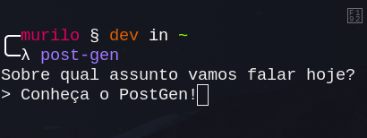

# PostGen - Gerador de Posts para LinkedIn

<div align="center">
    
</div>

Uma ferramenta de linha de comando (CLI) escrita em Python para gerar postagens técnicas no LinkedIn utilizando a API do Google Gemini. 

O script foi configurado com uma persona específica de **Estudante de Engenharia de Software / Desenvolvedor Backend (Java & Spring Boot)**. Ele gera textos com um tom pragmático, técnico e direto ao ponto, ideal para compartilhar aprendizados, desafios de arquitetura e código limpo, sem soar artificial.

## ✨ Funcionalidades

- **Geração Inteligente:** Utiliza o modelo `gemini-2.5-flash` para criar postagens rápidas e contextualizadas.
- **Persona Customizada:** O prompt interno (System Instruction) já está otimizado para não impor verdades absolutas, refletindo o perfil de um desenvolvedor júnior/estudante focado em boas práticas.
- **Formatação Pronta para Redes:** Textos com parágrafos curtos para leitura dinâmica no celular, limite de emojis e hashtags relevantes.
- **Histórico Automático:** Opção de salvar os posts gerados em arquivos Markdown (`.md`) organizados com data e hora exatas (Fuso horário de Brasília/São Paulo).
- **Organização de Diretórios:** Capacidade de mover automaticamente os arquivos gerados para uma pasta de histórico específica.

## 🛠️ Tecnologias Utilizadas

- [Python 3.12+](https://www.python.org/)
- [Google GenAI SDK](https://pypi.org/project/google-genai/)
- [python-dotenv](https://pypi.org/project/python-dotenv/)
- [uv](https://github.com/astral-sh/uv) (Gerenciamento de dependências e execução ultra-rápida)

## ⚙️ Pré-requisitos

1. Ter o Python 3.12 ou superior instalado.
2. Ter uma chave de API válida do [Google AI Studio](https://aistudio.google.com/).
3. (Recomendado) Ter o gerenciador de pacotes `uv` instalado.

## 🚀 Como instalar e configurar

1. Clone este repositório ou baixe os arquivos.
2. Crie o seu arquivo de variáveis de ambiente baseando-se no arquivo de exemplo:

```bash
cp .env.example .env
```

3. Abra o arquivo .env e adicione as suas configurações:

**Snippet de código**

```ini
GEMINI_API_KEY="sua-chave-gemini-aqui"

# Opcional: Caminho absoluto ou relativo para onde os arquivos .md devem ser movidos
DIR_HISTORY_PATH="/caminho/para/sua/pasta/de/historico"
```

> Dica: Se você não preencher o `DIR_HISTORY_PATH`, os arquivos `.md` serão salvos na mesma pasta do script.

## 💻 Como usar

Se você estiver utilizando o `uv`, pode rodar o script diretamente. Ele fará o download das dependências isoladamente usando o bloco de metadados no topo do arquivo:
```bash
uv run post-gen.py
```

**Exemplo de Uso**

Ao executar, o script fará uma pergunta no terminal:

```plaintext
Sobre qual assunto vamos falar hoje?
> Os desafios de configurar volumes no Docker para persistir dados do PostgreSQL no Spring Boot
```

A IA processará a resposta e exibirá a postagem formatada no terminal. Em seguida, você poderá escolher se deseja salvar o conteúdo:

```plaintext
Deseja salvar esse post no histórico (S/N): s

Post salvo: post_2026-03-27_15-30.md
```

Lembre-se, você pode editar o tom das respostas e as diretrizes de geração de posts no arquivo `post-gen.py`.

```python
# Tom das respostas
tone = "pragmático, técnico e direto ao ponto, não tão formal, com uma pitada de entusiasmo"

# Diretrizes & Instruções
system_instruction=f"""
    Você é um estudante de Engenharia de Software e Desenvolvedor Backend especializado em Java e Spring Boot.
    *restante...*
"""
```

> Você também pode editar o parâmetro `contents=` para personalizar o prompt.

## 🐧 Dica para usuários de Linux

Para permitir que o script seja executado, abra o terminal na pasta do script e rode:

```bash
chmod +x post-gen.py
```

Após isso, para não precisar digitar o caminho completo ou o `.py`, você pode criar um link para a sua pasta de binários local (symlink):

```bash
sudo ln -s $(pwd)/post-gen.py /usr/local/bin/post-gen
```

Para rodar o script de qualquer lugar do sistema sem precisar entrar na pasta do projeto, você pode criar um alias no seu terminal `(~/.bashrc, ~/.zshrc ou ~/.config/fish/config.fish)`:

```bash
alias post-gen="uv run /caminho/absoluto/para/o/projeto/post-gen.py"
```

Após recarregar o terminal `(source ~/.bashrc)`, basta digitar post-gen em qualquer diretório para gerar um novo post!

## 📝 Licença

Este projeto é de uso pessoal e livre para modificações. Sinta-se à vontade para alterar o System Instruction no código para se adequar a outras linguagens de programação ou senioridades.

> Criado por **muliroZ** ☕