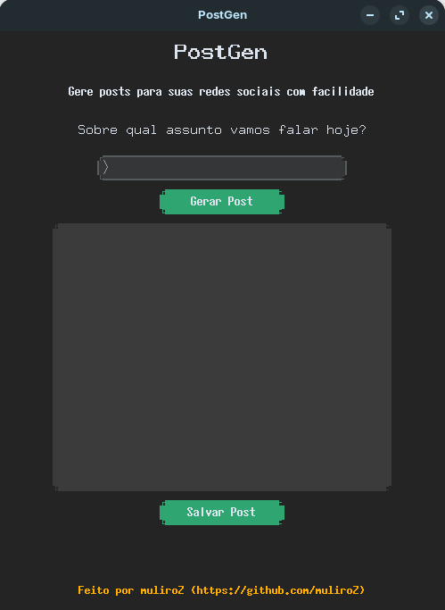
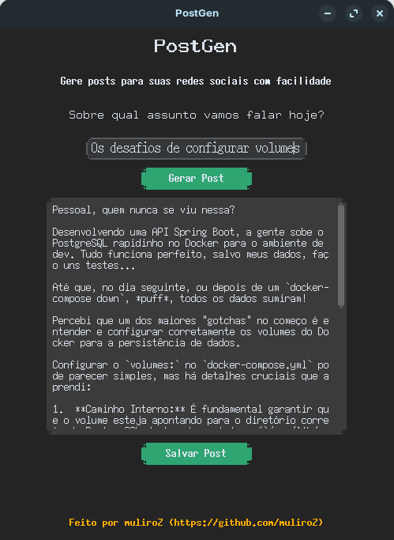
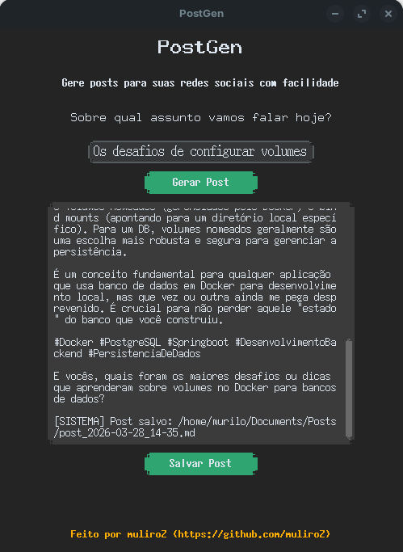

# PostGen - Gerador de Posts para LinkedIn

<div align="center">
    
</div>

Uma ferramenta modular desenvolvida em Python para automatizar a criação de conteúdos técnicos para o LinkedIn, utilizando a API do Google Gemini.

Esta versão introduz uma arquitetura baseada na separação de responsabilidades, oferecendo tanto uma Interface de Linha de Comando (CLI) quanto uma Interface Gráfica de Usuário (GUI), operando sobre a mesma lógica de negócio central.

O script foi configurado com uma persona específica de **Estudante de Engenharia de Software / Desenvolvedor Backend (Java & Spring Boot)**. Ele gera textos com um tom pragmático, técnico e direto ao ponto, ideal para compartilhar aprendizados, desafios de arquitetura e código limpo, sem soar artificial.

## ✨ Funcionalidades

- **Geração Inteligente:** Utiliza o modelo `gemini-2.5-flash` para criar postagens rápidas e contextualizadas.
- **Múltiplas Interfaces**: Escolha entre a rapidez do terminal (CLI) ou a conveniência visual da interface gráfica (GUI).
- **Persona Customizada:** O prompt interno (System Instruction) já está otimizado para não impor verdades absolutas, refletindo o perfil de um desenvolvedor júnior/estudante focado em boas práticas.
- **Formatação Pronta para Redes:** Textos com parágrafos curtos para leitura dinâmica no celular, limite de emojis e hashtags relevantes.
- **Histórico Automático:** Opção de salvar os posts gerados em arquivos Markdown (`.md`) organizados com data e hora exatas (Fuso horário de Brasília/São Paulo).
- **Organização de Diretórios:** Capacidade de mover automaticamente os arquivos gerados para uma pasta de histórico específica.

## 🛠️ Tecnologias Utilizadas

- [Python 3.12+](https://www.python.org/)
- [Google GenAI SDK](https://pypi.org/project/google-genai/)
- [python-dotenv](https://pypi.org/project/python-dotenv/)
- [customtkinter](https://customtkinter.tomschimansky.com/) (Interface Gráfica de Usuário)
- [uv](https://github.com/astral-sh/uv) (Gerenciamento de dependências e execução ultra-rápida)

## ⚙️ Pré-requisitos

1. Ter o Python 3.12 ou superior instalado.
2. Ter uma chave de API válida do [Google AI Studio](https://aistudio.google.com/).
3. (Recomendado) Ter o gerenciador de pacotes `uv` instalado.

## 🚀 Como instalar e configurar

1. Clone este repositório ou baixe os arquivos.
2. Crie o seu arquivo de variáveis de ambiente baseando-se no arquivo de exemplo:

```bash
cp .env.example .env
```

3. Abra o arquivo .env e adicione as suas configurações:

**Snippet de código**

```ini
GEMINI_API_KEY="sua-chave-gemini-aqui"

# Opcional: Caminho absoluto ou relativo para onde os arquivos .md devem ser movidos
DIR_HISTORY_PATH="/caminho/para/sua/pasta/de/historico"
```

> Dica: Se você não preencher o `DIR_HISTORY_PATH`, os arquivos `.md` serão salvos na mesma pasta do script.

## 📂 Estrutura do Projeto

```ini
post-gen/
├── assets/                 # Imagens e recursos para a GUI
├── core/                   # Lógica central do projeto
│   ├── cli.py              # Interface de Linha de Comando
│   ├── view.py             # Interface Gráfica de Usuário
│   └── post_gen.py         # Lógica de geração de posts (com api do Google Gemini)
├── .env.example            # Exemplo de arquivo de variáveis de ambiente
├── README.md               # Documentação do projeto
├── LICENSE                # Licença do projeto
├── uv.lock                 # Arquivo de bloqueio de dependências gerado pelo uv
└── pyproject.toml          # Lista de dependências e configurações do projeto
```

## 💻 Como usar

Se você estiver utilizando o `uv`, pode rodar o script diretamente. Ele fará o download das dependências isoladamente usando o bloco de metadados no topo do arquivo:
```bash
# Terminal (CLI)
uv run core/cli.py

# Interface Gráfica (GUI)
uv run core/view.py
```

---

**Exemplo de Uso (CLI)**

Ao executar, o script fará uma pergunta no terminal:

```plaintext
Sobre qual assunto vamos falar hoje?
> Os desafios de configurar volumes no Docker para persistir dados do PostgreSQL no Spring Boot
```

A IA processará a resposta e exibirá a postagem formatada no terminal. Em seguida, você poderá escolher se deseja salvar o conteúdo:

```plaintext
Deseja salvar esse post no histórico (S/N): s

Post salvo: post_2026-03-27_15-30.md
```

**Exemplo de Uso (GUI)**

Ao executar, a interface aparecerá em sua tela:

<div align="center">
    
</div>

Digite o assunto no campo de entrada e clique no botão "Gerar Post", a IA processará a resposta e exibirá o post formatado no campo de texto abaixo do botão "Gerar Post":

<div align="center">
    
</div>

Caso você queira salvar o post gerado, aperte o botão "Salvar Post", e o conteúdo será salvo no caminho especificado na variável de ambiente `DIR_HISTORY_PATH`. Logo após isso, você verá uma mensagem de sucesso no final da caixa de texto, com o caminho onde o arquivo foi salvo.

<div align="center">
    
</div>

> Nota: A interface gráfica está em versão experimental, as imagens foram capturadas em uma máquina com Zorin OS (distro Linux baseada em Ubuntu), e apresentou alguns problemas, como a qualidade baixa da GUI e a incompatibilidade nativa do `Tkinter` com alguns gerenciadores de input de teclados no Linux (como o IBus). A versão de Windows muito provavelmente não possui esses problemas, mas nada confirmado.

---

Lembre-se, você pode editar o tom das respostas e as diretrizes de geração de posts no arquivo `post-gen.py`.

```python
# Tom das respostas
tone = "pragmático, técnico e direto ao ponto, não tão formal, com uma pitada de entusiasmo"

# Diretrizes & Instruções
system_instruction=f"""
    Você é um estudante de Engenharia de Software e Desenvolvedor Backend especializado em Java e Spring Boot.
    *restante...*
"""
```

> Você também pode editar o parâmetro `contents=` para personalizar o prompt.

## 🐧 Dica para usuários de Linux

Para permitir que o script seja executado, abra o terminal na pasta do script e rode:

```bash
chmod +x cli.py
```

Após isso, para não precisar digitar o caminho completo ou o `.py`, você pode criar um link para a sua pasta de binários local (symlink):

```bash
sudo ln -s $(pwd)/cli.py /usr/local/bin/post-gen
```

Para rodar o script de qualquer lugar do sistema sem precisar entrar na pasta do projeto, você pode criar um alias no seu terminal `(~/.bashrc, ~/.zshrc ou ~/.config/fish/config.fish)`:

```bash
alias post-gen="uv run /caminho/absoluto/para/a/pasta/do/script/cli.py"
```

Após recarregar o terminal `(source ~/.bashrc)`, basta digitar post-gen em qualquer diretório para gerar um novo post!

## Contribuições

Contribuições são bem-vindas! Se você tiver sugestões de melhorias, correções de bugs ou novas funcionalidades, sinta-se à vontade para abrir uma issue ou enviar um pull request.

## 📝 Licença

Este projeto é de uso pessoal e livre para modificações. Sinta-se à vontade para alterar o System Instruction no código para se adequar a outras linguagens de programação ou senioridades.

> *Criado por **muliroZ** ☕*