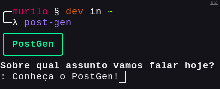
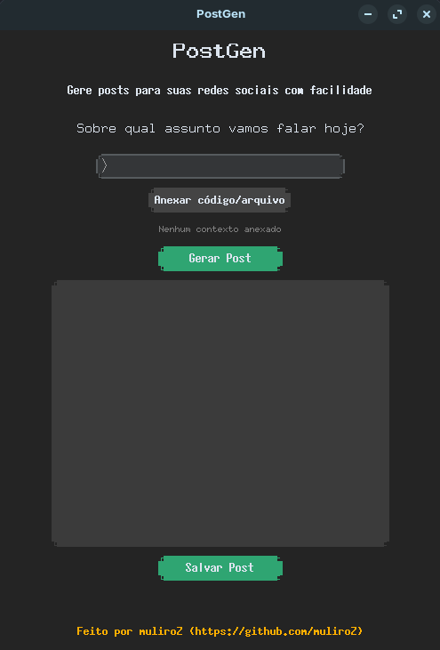
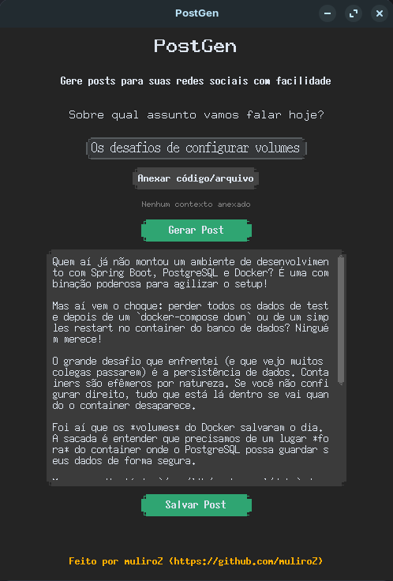
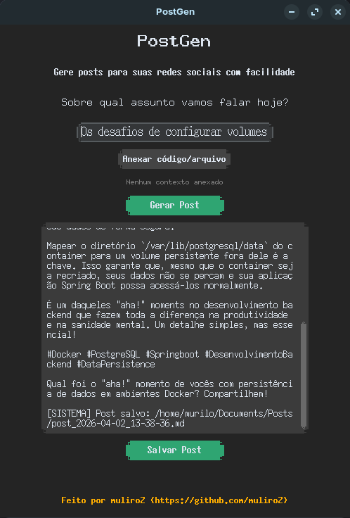

# PostGen - Gerador de Posts para LinkedIn

<div align="center">
    
</div>

Uma ferramenta modular desenvolvida em Python para automatizar a criação de conteúdos técnicos para o LinkedIn, utilizando a API do Google Gemini.

Esta versão consolida uma arquitetura baseada na separação de responsabilidades, oferecendo tanto uma Interface de Linha de Comando (CLI) quanto uma Interface Gráfica de Usuário (GUI), ambas operando sobre a mesma lógica de negócio central e com suporte a leitura de contexto de arquivos locais.

O script foi configurado com uma persona específica de **Estudante de Engenharia de Software / Desenvolvedor Backend (Java & Spring Boot)**. Ele gera textos com um tom pragmático, técnico e direto ao ponto, ideal para compartilhar aprendizados, desafios de arquitetura e código limpo, sem soar artificial.

## ✨ Funcionalidades

- **Geração Inteligente:** Utiliza o modelo `gemini-2.5-flash` para criar postagens rápidas e contextualizadas.
- **Análise de Contexto Local:** Capacidade de anexar arquivos de código (Java, Python, YAML, etc.) para que a IA gere a publicação baseada estritamente em um exemplo real do seu projeto.
- **Múltiplas Interfaces**: Escolha entre a rapidez do terminal (CLI) ou a conveniência visual da interface gráfica (GUI).
- **GUI Responsiva:** Processamento de requisições em background (via `threading`) para evitar congelamento da interface durante a comunicação com a API.
- **Formatação Pronta para Redes:** Textos com parágrafos curtos para leitura dinâmica no celular, limite de emojis e hashtags relevantes.
- **Histórico Automático:** Opção de salvar os posts gerados em arquivos Markdown (`.md`) organizados com data e hora exatas (Fuso horário de Brasília/São Paulo).
- **Organização de Diretórios:** Capacidade de mover automaticamente os arquivos gerados para uma pasta de histórico específica.

## 🛠️ Tecnologias Utilizadas

- [Python 3.12+](https://www.python.org/)
- [Google GenAI SDK](https://pypi.org/project/google-genai/)
- [python-dotenv](https://pypi.org/project/python-dotenv/)
- [customtkinter](https://customtkinter.tomschimansky.com/) (Interface Gráfica de Usuário)
- [uv](https://github.com/astral-sh/uv) (Gerenciamento de dependências e execução ultra-rápida)
- **Pytest** (Suíte de testes automatizados)
- **PyInstaller** (Geração de executáveis standalone)

## ⚙️ Pré-requisitos

1. Ter o Python 3.12 ou superior instalado.
2. Ter uma chave de API válida do [Google AI Studio](https://aistudio.google.com/).
3. (Recomendado) Ter o gerenciador de pacotes `uv` instalado.

## 🚀 Como instalar e configurar

1. Clone este repositório ou baixe os arquivos.
2. Crie o seu arquivo de variáveis de ambiente baseando-se no arquivo de exemplo:

```bash
cp .env.example .env
```

3.  Abra o arquivo `.env` e adicione as suas configurações:

```ini
GEMINI_API_KEY="sua-chave-gemini-aqui"

# Opcional: Caminho absoluto ou relativo para onde os arquivos .md devem ser movidos
DIR_HISTORY_PATH="/caminho/para/sua/pasta/de/historico"
```

> Dica: Se você não preencher o `DIR_HISTORY_PATH`, os arquivos `.md` serão salvos na mesma pasta do script.

## 📂 Estrutura do Projeto

```ini
post-gen/
├── assets/                 # Imagens e recursos para a GUI
├── core/                   # Lógica central do projeto
│   ├── cli.py              # Interface de Linha de Comando
│   ├── view.py             # Interface Gráfica de Usuário
│   └── post_gen.py         # Lógica de geração de posts (API do Google Gemini)
├── tests/                  # Suíte de testes unitários (pytest)
├── install.sh              # Script de instalação global para Linux/macOS
├── .env.example            # Exemplo de arquivo de variáveis de ambiente
├── README.md               # Documentação do projeto
├── LICENSE                 # Licença do projeto
├── uv.lock                 # Arquivo de bloqueio de dependências gerado pelo uv
└── pyproject.toml          # Lista de dependências e configurações do projeto
```

## 💻 Como usar durante o desenvolvimento

Se você estiver utilizando o `uv`, pode rodar os scripts diretamente. Ele fará o download das dependências isoladamente:

```bash
# Terminal (CLI)
uv run core/cli.py

# Interface Gráfica (GUI)
uv run core/view.py
```

-----

**Exemplo de Uso (CLI)**

Ao executar, o script fará perguntas interativas no terminal, permitindo inclusive o "arrastar e soltar" de arquivos para gerar contexto:

```plaintext
Sobre qual assunto vamos falar hoje?
> Os desafios de configurar volumes no Docker para persistir dados do PostgreSQL no Spring Boot

[Opcional] Deseja anexar algum arquivo de código ou configuração como contexto?
Dica: Pode arrastar o arquivo para o terminal ou digitar o caminho.
Caminho do arquivo (ou pressione Enter para pular):
> /caminho/para/docker-compose.yml
```

A IA processará a resposta e exibirá a postagem formatada no terminal. Em seguida, você poderá escolher se deseja salvar o conteúdo:

```plaintext
Deseja salvar esse post no histórico (S/N): s

Post salvo: post_2026-03-27_15-30.md
```

**Exemplo de Uso (GUI)**

Ao executar, a interface aparecerá em sua tela:

<div align="center">
    
</div>

A interface permite a digitação do tópico e possui um botão dedicado **"Anexar Código/Arquivo"**, que abre o explorador de arquivos nativo do seu sistema operacional. A geração ocorre de forma assíncrona, mantendo a interface livre de travamentos.

<div align="center">
    
</div>

Caso você queira salvar o post gerado, aperte o botão "Salvar Post", e o conteúdo será salvo no caminho especificado na variável de ambiente `DIR_HISTORY_PATH`. Logo após isso, você verá uma mensagem de sucesso no final da caixa de texto, com o caminho onde o arquivo foi salvo.

<div align="center">
    
</div>

> Nota: A interface gráfica está em versão experimental, as imagens foram capturadas em uma máquina com Zorin OS (distro Linux baseada em Ubuntu), e apresentou alguns problemas, como a qualidade baixa da GUI e a incompatibilidade nativa do `Tkinter` com alguns gerenciadores de input de teclados no Linux (como o IBus). A versão de Windows muito provavelmente não possui esses problemas, mas nada confirmado (ainda).

---

Lembre-se, você pode editar o tom das respostas e as diretrizes de geração de posts no arquivo `post-gen.py`.

```python
# Tom das respostas
tone = "pragmático, técnico e direto ao ponto, não tão formal, com uma pitada de entusiasmo"

# Diretrizes & Instruções
system_instruction=f"""
    Você é um estudante de Engenharia de Software e Desenvolvedor Backend especializado em Java e Spring Boot.
    *restante...*
"""
```

> Você também pode editar o parâmetro `contents=` para personalizar o prompt.

## 🌍 Instalação Global Automática (CLI no Linux/macOS)

Para transformar o `post-gen` em um comando global do seu sistema, sem se preocupar com a pasta atual ou ativação manual de ambientes, utilize o script de instalação incluído.

Na raiz do projeto, execute:

```bash
chmod +x install.sh
./install.sh
```

*O script criará um wrapper seguro em `/usr/local/bin/post-gen` (exigirá senha de `sudo`). Após isso, basta digitar `post-gen` em qualquer diretório do seu terminal.*

## 📦 Gerando Executáveis (Windows)

Você pode compilar a Interface Gráfica (GUI) em um único arquivo executável (Standalone) que não exige a instalação do Python ou execução via terminal na máquina de destino.

Utilize o PyInstaller (já configurado nas dependências de desenvolvimento do `uv`):

```pwsh
# Executar no terminal (PowerShell ou CMD) dentro da raiz do projeto
uv run pyinstaller --noconsole --onefile --name PostGen core/view.py
```

O executável final (`.exe`) será gerado dentro da pasta `dist/`. Você pode mover esse arquivo para qualquer lugar do seu sistema e executá-lo diretamente, sem necessidade de Python ou dependências adicionais.

## 🧪 Rodando os Testes

O projeto conta com uma suíte de testes automatizados utilizando `pytest` para garantir a integridade das operações de I/O de arquivos e o tratamento de chamadas à API (via mocks).

Para rodar os testes:

```bash
uv run pytest -v
```

## Contribuições

Contribuições são bem-vindas! Se você tiver sugestões de melhorias, correções de bugs ou novas funcionalidades, sinta-se à vontade para abrir uma issue ou enviar um pull request.

## 📝 Licença

Este projeto é de uso pessoal e livre para modificações. Sinta-se à vontade para alterar o System Instruction no código para se adequar a outras linguagens de programação ou senioridades.

> *Criado por **muliroZ** ☕*
